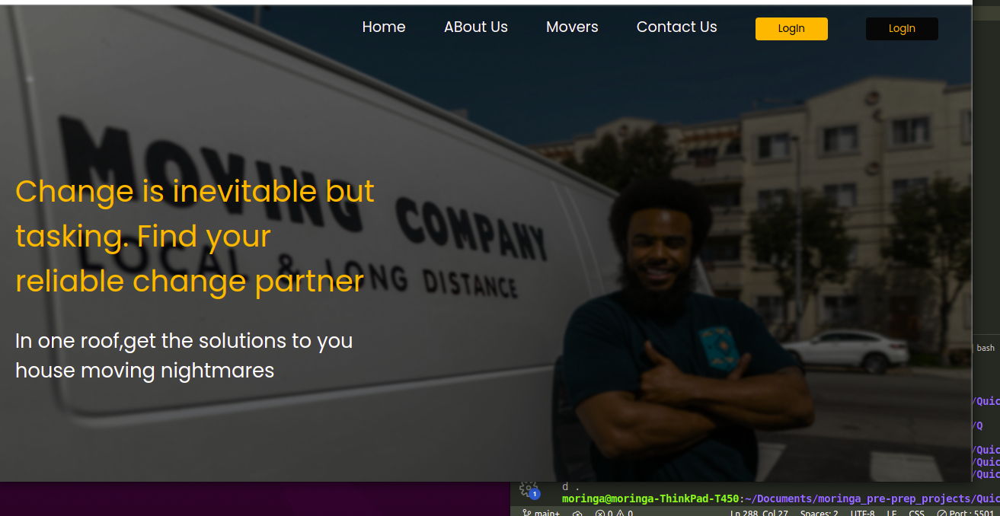

# QUICK MOVERS

***
## About/Description
Quick Movers is a website that helps people locate places they would like to live and have modern houses. The website makes the process of moving in and out to new places much easier and of high quality because of the classic houses that we provide. We can also custom any house Of your choice. The cost fo each house is affordable and of great quality example:


## web-Demo
Here is a working demonstration of this Web page: https://jobsidney.github.io/Quick-movers-website/

***
## The Site
## [Installation](hhttps://jobsidney.github.io/Quick-movers-website/) 



### How To Contribute

The process below will enable you make contribution to this website for a better view and functionality

- Fork the repo
- Create a new branch (`git checkout -b NewFeature`).
- Make the changes you want to the files and folders.
- Add the changes (`git add .`).
- to reflect the changes.
- commit changes (`git commit -m 'This is a Contribution commit'`).
- push changes to the branch (`git push origin NewFeature`).
- Do a pull Request.
  


## [Features](https://jobsidney.github.io/Quick-movers-website/)

- HTML5
- Well Designed Interface(UI).
- intensive use of pure css for design
- Switch to multiple pages via links and buttons
- Responsive to variety of devices like mobile,tablet and PC
  

## Target to future improvement
- Incoperate Javascript
- Add drop down menu
  
### Program Sample
#### Html code
```Html
  <!--CUT THE HUSTLE-->
        <section id="cutTheHustle">
            <div>
                
            </div>
            <div id="HustleText">
                <div class="line"></div>
                <div><h1>Cut the Hustle</h1></div>
                <div class="descr">In this current tough economic situations
                    ,living is already a hustle. Why then should you worry ABout
                    how you should move to live better?
                </div>
                <div>
                    <button>Learn more <span style="color:#FFAC12;font-size: 20px;margin-left: 2px;">&#x27A1;</span></button>
                </div>
            </div>
      
        </section>
```

#### Css
    Example of Css with media query for responsiveness
```Css
/* tablet */


@media only screen and (max-width:800px) {
  nav{
    margin-left: 1px;
    margin-right: 1%;
}
nav > ul{
    margin-top: 20px;
    display: flex;
    justify-content: end;
    text-decoration: none;
    margin-right: 0px;
    margin-top: 2%;
    margin-left: 0px;
    
    color: white;
    /* helps make navigation responsive*/
    
}
```
## Author
- Jobsidney
- [](https://github.com/Jobsidney/)
  
